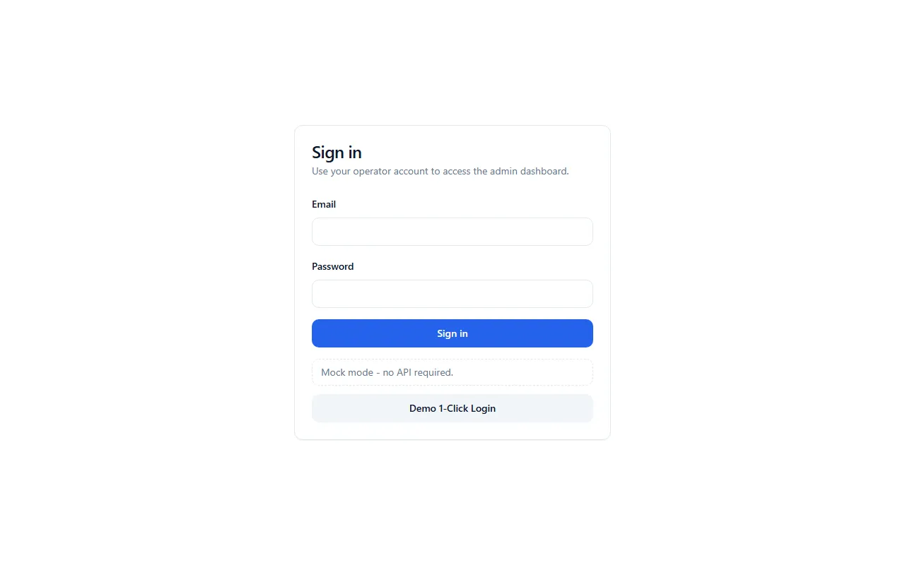

# E-commerce Admin Dashboard

<p align="center">
  <a href="https://github.com/raouf-b-dev/ecommerce-admin-dashboard/actions"></a>
  <a href="https://www.typescriptlang.org/"></a>
  <a href="https://react.dev/"></a>
  <a href="https://vitejs.dev/"></a>
  <a href="https://tailwindcss.com/"></a>
  <a href="https://tanstack.com/query"></a>
  <a href="LICENSE"></a>
</p>

> Admin UI for the [E-commerce Store API](https://github.com/raouf-b-dev/ecommerce-store-api). Operators manage catalog, stock, orders, and access. Business rules stay in the API.

<p align="center">
  
</p>

## What this is

A Vite + React operator console. Screens are typed from the API OpenAPI spec: dashboard, products, categories, inventory, orders, users, and roles.

The UI hides nav or shows a forbidden page when a permission is missing. Authorization still happens on the API. There is no BFF.

No hosted demo. Payments on order detail are read-only. `npm run dev:mock` is for UI work; Playwright still needs a live API.

## Quick start

Tested against Node.js 24 and npm 11.

```bash
git clone https://github.com/raouf-b-dev/ecommerce-admin-dashboard.git
cd ecommerce-admin-dashboard
npm install
npm run env:init
```

### Without the API

MSW. No Docker, Postgres, Redis, or API process.

```bash
npm run dev:mock
```

Open `http://localhost:5174` and use **Demo 1-Click Login**. Mock data resets on full reload.

### Against a local API

Needs a running [ecommerce-store-api](https://github.com/raouf-b-dev/ecommerce-store-api) (default `http://localhost:3000`).

```bash
npm run dev
```

Open `http://localhost:5174`. Sign in with a seeded administrator from the API [seeding guide](https://github.com/raouf-b-dev/ecommerce-store-api/blob/master/docs/development/SEEDING.md). The first login requires a password change.

After the API contract changes, run `npm run api:generate` while the API is up.

## Screenshots

<p align="center">
  
</p>

<p align="center">
  
</p>

<p align="center">
  
</p>

## Where to look

| Topic | Path |
| :---- | :--- |
| OpenAPI client and silent refresh | [`src/lib/api/client.ts`](src/lib/api/client.ts) |
| Session and permission chrome | [`src/lib/auth/auth-context.tsx`](src/lib/auth/auth-context.tsx) |
| Role permission editor | [`src/features/roles/components/edit-role-dialog.tsx`](src/features/roles/components/edit-role-dialog.tsx) |

Checkout SAGA, inventory locks, and module boundaries: [ecommerce-store-api](https://github.com/raouf-b-dev/ecommerce-store-api).

## Architecture

Browser → Vite SPA (React Router) → versioned HTTP API.

- Access token in memory; refresh cookie is HttpOnly.
- Permissions come from the API session. The UI hides chrome; it does not grant access.
- Lists and mutations use TanStack Query and the generated OpenAPI client.
- `dev:mock` is an in-browser MSW replica of those same HTTP contracts.

Longer write-up: [`docs/architecture/ARCHITECTURE.md`](docs/architecture/ARCHITECTURE.md).

## Verify

```bash
npm run lint
npm run typecheck
npm test
npm run build
npm run test:e2e    # live API; see e2e/README.md
```

PR CI runs lint, typecheck, unit tests, build, and `npm audit`. Playwright runs on `main`/`master` and `workflow_dispatch`.

## Stack

Vite, React 19, TypeScript, Tailwind + shadcn/ui, TanStack Query, TanStack Table, React Hook Form + Zod, Recharts, Socket.IO, `openapi-fetch`, Vitest, Playwright.

## Docs

[`docs/README.md`](docs/README.md) · [`SECURITY.md`](SECURITY.md) · [`docs/API-INTEGRATION.md`](docs/API-INTEGRATION.md) · [ADRs](docs/architecture/adr/README.md)

Related: [`ecommerce-store-api`](https://github.com/raouf-b-dev/ecommerce-store-api) (backend). `ecommerce-store-web` (storefront) is not published yet.

```
src/
├── app/          # router, navigation
├── features/     # auth, products, orders, dashboard, ...
├── components/   # shell, theme, shared UI
└── lib/          # OpenAPI client, auth, WebSocket
```

## License

[MIT](LICENSE)

Built by [Abderaouf .B](https://github.com/raouf-b-dev) · [Issues](https://github.com/raouf-b-dev/ecommerce-admin-dashboard/issues)
