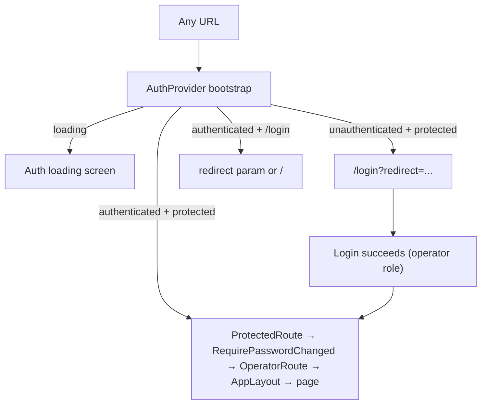
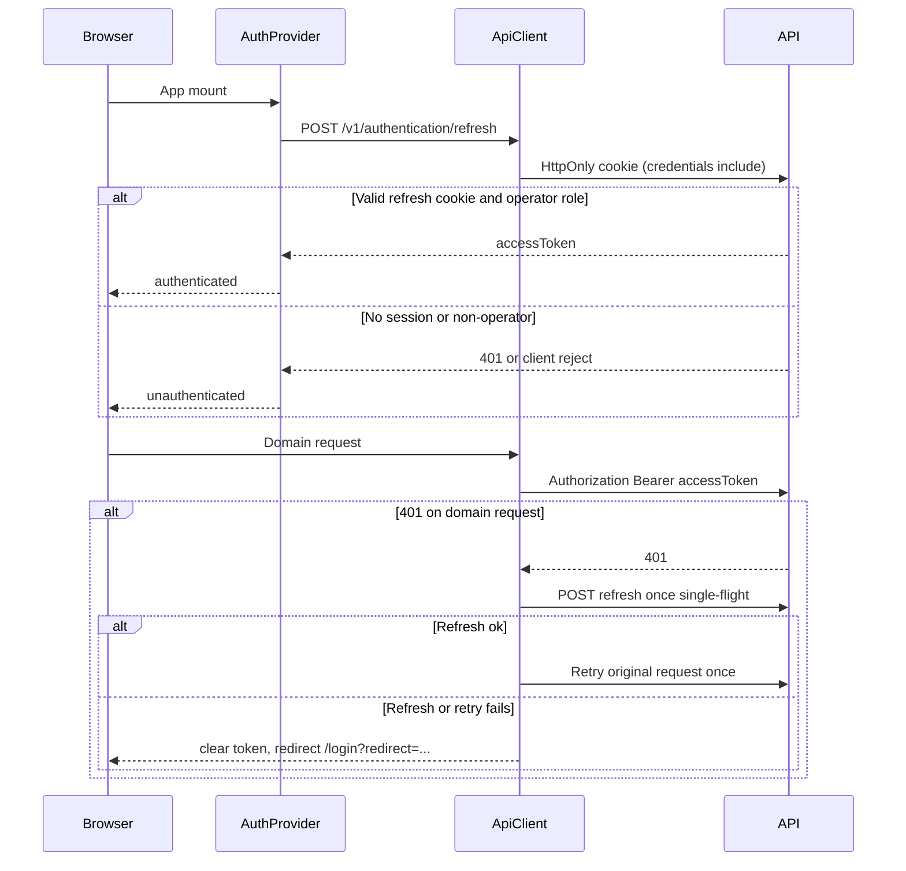

# Admin SPA Architecture

High-level architecture for the operator-facing Vite + React dashboard.

## System context

```text
Browser → Vite SPA (React Router) → versioned HTTP API → ecommerce-store-api
                                                          ↑
Storefront / mobile apps ---------------------------------+
```

Backend context: [ecommerce-store-api ARCHITECTURE.md](https://github.com/raouf-b-dev/ecommerce-store-api/blob/master/docs/architecture/ARCHITECTURE.md).

| Rule | Detail |
| :--- | :----- |
| Boundary | Status changes, stock, refunds, and RBAC enforcement live in the API. |
| Data access | Typed client from OpenAPI (`openapi-fetch` + generated schema). |
| Client data | TanStack Query for lists, detail, and mutations. |
| Tables | TanStack Table for admin grids (Phase 3+). |
| Auth / RBAC UX | Hide or disable controls from claims; never treat that as security. |
| Conflicts | Surface HTTP 409 so the operator can reload and retry (Phase 3+). |

## App composition

```text
QueryClientProvider
  └── AuthProvider          # session bootstrap, login/logout, permission helpers
        └── RouterProvider  # public /login vs protected AppLayout tree
```

## Routing model

Rationale: [ADR-0001](adr/ADR-0001-auth-first-routing-and-route-guards.md).



- `/login` — sole public route; no admin chrome
- Shell routes — `ProtectedRoute` → `RequirePasswordChanged` → `OperatorRoute` → `AppLayout` → feature page
- `OperatorRoute` — requires `access_admin` ([ADR-0006](adr/ADR-0006-operators-only-admin-spa.md))
- `PermissionRoute` — optional route-level 403 UX inside the shell (Dashboard/Orders require `view_all_orders`)

## Auth and session flow

Rationale: [ADR-0002](adr/ADR-0002-in-memory-access-token-with-httponly-refresh-cookie.md), [ADR-0005](adr/ADR-0005-silent-one-shot-access-token-refresh.md).



| Storage | Policy |
| :------ | :----- |
| Access token | In-memory only (`src/lib/auth/auth-session.ts`) |
| Refresh token | HttpOnly cookie set by API; `credentials: 'include'` on client |
| Permission claims | From auth response `permissions` (DB-resolved) |

## RBAC model

Rationale: [ADR-0007](adr/ADR-0007-auth-response-permissions-for-chrome.md) (supersedes [ADR-0003](adr/ADR-0003-client-rbac-chrome-api-authoritative.md)).

- Nav items in `src/app/navigation.ts` declare optional `permission` codes
- `AppSidebar` filters items via `filterNavigation()` and `useAuth().hasPermission()`
- `PermissionRoute` renders forbidden UX when a route requires a missing claim
- API `403` responses are final; the SPA does not invent bypasses

## Data flow

- **Server state** — TanStack Query in feature hooks; query keys start with feature name
- **API calls** — `apiClient` wrapper over generated OpenAPI types
- **Forms** — React Hook Form + Zod aligned to API DTOs
- **No client domain engine** — business rules stay in the API

## Source layout

```text
src/
├── app/                  # router.tsx, navigation.ts, app-level pages
├── components/
│   ├── layout/           # AppLayout, sidebar, header, mobile nav
│   └── ui/               # shadcn-style primitives
├── features/
│   └── <name>/
│       ├── api/          # thin OpenAPI wrappers
│       ├── components/
│       ├── pages/        # route entry components
│       └── schemas/      # Zod aligned to DTOs
├── lib/
│   ├── api/              # generated schema + apiClient middleware
│   └── auth/             # AuthProvider, guards, permissions helpers
docs/
├── architecture/         # this tree
├── API-INTEGRATION.md
└── ai/                   # conventions and agent docs
```

## Related documentation

| Document | Description |
| :------- | :---------- |
| [`docs/API-INTEGRATION.md`](../API-INTEGRATION.md) | Client rules; OpenAPI owns endpoints |
| [`SECURITY.md`](../../SECURITY.md) | Frontend security baseline |
| [`docs/ai/CONVENTIONS.md`](../ai/CONVENTIONS.md) | Feature layout, Query, forms, guards |
| [`docs/ROADMAP.md`](../ROADMAP.md) | Delivery phases |
